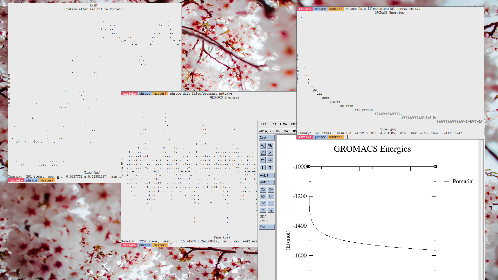

# phrace

_**NOTE:** This repository has been moved to [git.sr.ht/~ma3ke/phrace](https://git.sr.ht/~ma3ke/phrace)._



A terminal viewer for `.xvg` files.

Gromacs tools can output _xvg_ files to inspect a range of properties of molecular dynamics trajectories (e.g. [`gmx energy`](https://manual.gromacs.org/current/onlinehelp/gmx-energy.html)).
These data files are commonly viewed with the [Grace](https://plasma-gate.weizmann.ac.il/Grace/) (`xmgrace`) tool.[^grace]

[^grace]: By the way, insanely cool website. Check it out!

## Installation

If you don't have [Rust](https://www.rust-lang.org/) installed on your system, learn how to do it [here](https://www.rust-lang.org/learn/get-started). It is very easy.

To install the binary, run the following command.

```console
cargo install phrace
```

## Usage

Simply invoke with a path to an _xvg_ file.
The size of the plot will be inferred from the terminal size.

```console
phrace example_data/potential_energy_em.xvg
```

```
                 GROMACS Energies                 
  ░                                               
                                                  
   ░                                              
                                                  
                                                  
                                                  
(                                                 
k  ░                                              
J  ░                                              
/  ░                                              
m  ░░                                             
o   ▒                                             
l    ▓░                                           
)     ▓▒                                          
       ░█▓▒                                       
          ▒▓██▒                                   
              ░▓▓█▓▓██                            
                      ▓██▓█▓▓█▓▓▓                 
                                ░▓▓█▓█▓█▓▓█▓▓██▓█▓
                                                 ░
                   Time (ps)                    
Summary:  393 items,  mean ± σ  -1512.5859 ± 54.731205,  min … max  -1565.1497 … -1111.5247
```

You can specify the width and/or height explicitly as well.

```console
phrace -w 50 -h 25 example_data/ramachandran.xvg
```

```
                Ramachandran Plot                 
            ░░░░░░░░░            ░░ ░░░░░    ░  ░ 
  ░░░░░░░░░░░░░░░░░░░░░            ░ ░   ░        
   ░░░░░░░░░░░░░░░░░░░░░           ░  ░  ░ ░     ░
   ░░░ ░░░░░░░░░░░░░░░░                      ░   ░
    ░░░░░░░ ░░░░░░░░░                             
       ░░░░░░░░░░░░░               ░░             
   ░     ░ ░░░░░░░░ ░                             
             ░░░░░░░               ░░   ░         
P        ░ ░ ░░░░░░               ░ ░       ░  ░ ░
s  ░░░     ░░░░░░░░░             ░░ ░ ░    ░ ░░░░░
i  ░░░░   ░░░░░░░░░░░░            ░░░░░ ░ ░ ░░░░░░
   ░░░░ ░   ░░░░▒▓█▒░░░░          ░░░░░░░░ ░░ ░░░░
   ░░░░    ░  ░░░░▒░░░░░           ░░░ ░░░░░░░░ ░░
   ░░░░  ░ ░░░ ░░░░░░░             ░░  ░  ░░  ░░  
    ░░   ░ ░   ░ ░             ░░░░░ ░      ░ ░   
    ░░          ░            ░ ░░░░░░ ░░ ░ ░      
     ░░   ░    ░               ░░░░░░░░░          
   ░        ░  ░░░░           ░░ ░░░░░  ░     ░░░ 
     ░        ░░░░░░            ░░░░░░░░░   ░░░  ░
                                     ░            
                      Phi                       
Summary:  3618 items,  mean ± σ  8.999559 ± 90.19915,  min … max  -179.764 … 179.746
```

Rendering the plot with an ASCII style is also possible.

```console
phrace --style ascii -w30 -h20 example_data/potential_energy_em.xvg
```

```
       GROMACS Energies       
  .                           
(  .                          
k                             
J  .                          
/  :                          
m  -=                         
o   =#*                       
l     :#%#%#@-                
)            +#%%#%#@#%#@#%#%#
                             .
         Time (ps)          
Summary:  393 items,  mean ± σ  -1512.5859 ± 54.731205,  min … max  -1565.1497 … -1111.5247
```

## Future work

If I have some time, I want to add more options to change the viewport, add axis tick labels, ability to plot multiple columns at once.
For now, it fits my needs, and I am putting it out there for others to use in case they find it useful in its current state.

I am interested in adding support for more data formats.
Honestly, it would be pretty cool to add the ability to graph out some weird and esoteric formats, but maybe doing like... csv is cool too I guess.
Get in touch if you have a particular need, and we can see whether we can pull some programming crimes together.

More plotting styles may also pop up if I feel inspired.

In other words: contributions and collaboration welcome.

## Dependencies

Depends on the [`terminal_size`](https://crates.io/crates/terminal_size) crate for getting the width and height of the terminal.
Depends on the [`lexopt`](https://crates.io/crates/lexopt) crate for parsing command line arguments.
No other dependencies.

---

By [Ma3ke](https://hachyderm.io/@ma3ke).
